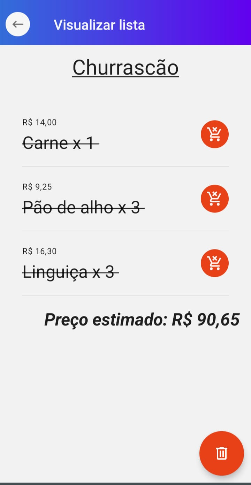

<h1 align="center">Market List</h1>

  Aplicativo para gerenciamento de listas de supermercado. Chega de bloco de notas ou listas em papel!

  

## Tecnologias usadas :rocket:

- [Expo](https://expo.dev/)
- [React](https://pt-br.reactjs.org/)
- [React Native](https://reactnative.dev/)
- [React Native Vector Icons](https://oblador.github.io/react-native-vector-icons/)
- [React Native Paper](https://callstack.github.io/react-native-paper/)
- [Lottie](https://lottiefiles.com)

## Funcionalidades :video_game:

- Criar listas de compras.
- Visualizar total de gasto e total de produtos comprados.
- Preço estimado da lista de compras(o usuário precisa informar o valor dos produtos).
- Remoção de lista de compras.
- Escolha de cor principal.
- Atualizações programáticas.

## Imagens :sparkles:

<h3 align="center">Splash Screen</h3>

  

<h3 align="center">Home</h3>

  
  

<h3 align="center">Nova compra</h3>

    
    
     

<h3 align="center">Visualizar compra</h3>

  
    

## Instalar/Executar :hammer:

1. Baixe o repositório em seu computador.
2. Navegue até a pasta do projeto.
3. Instale as dependências com `npm install` ou `yarn install`.
4. Instale o [Expo](https://expo.dev/).
5. Execute o expo com o comando `expo start`.

## Agradecimento :heart:

[Splash Screen Animada](https://lottiefiles.com/53735-cart-icon-loader)

[Funcão para formatar o preço](https://gist.github.com/kafeltz/1b99cbaa9dc2142e04ca)

## Observações :warning:

A versão do navegador pode conter MUITOS bugs.
  
O Aplicativo não foi testado na plataforma iOS, caso queira testar e contribuir(achar bugs, arrumar estilos, etc) com o projeto, por favor abra um PR.
